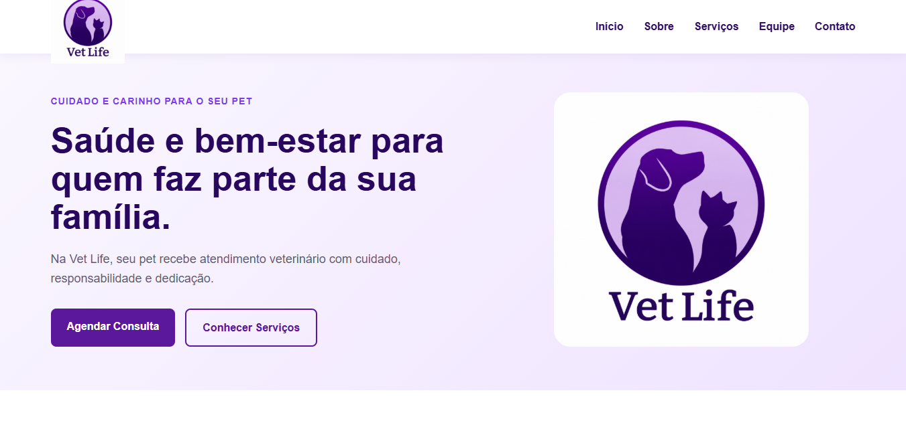
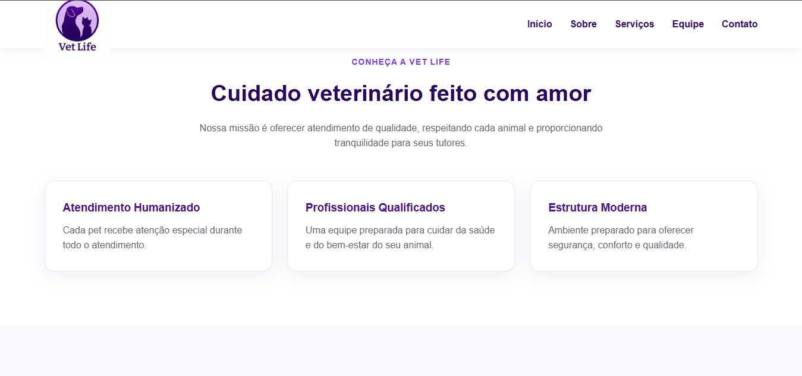
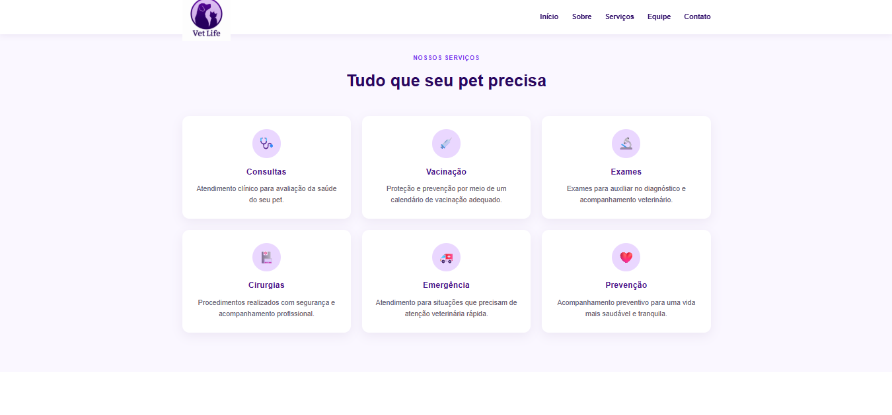
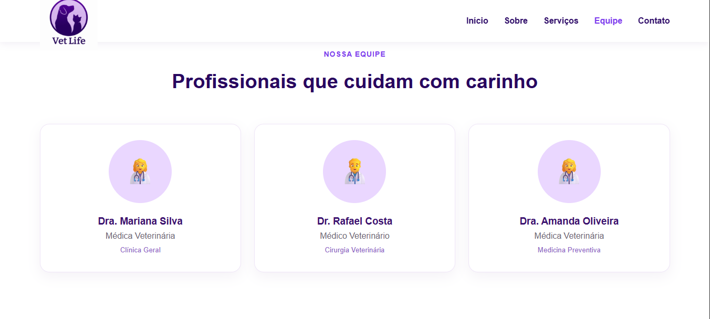
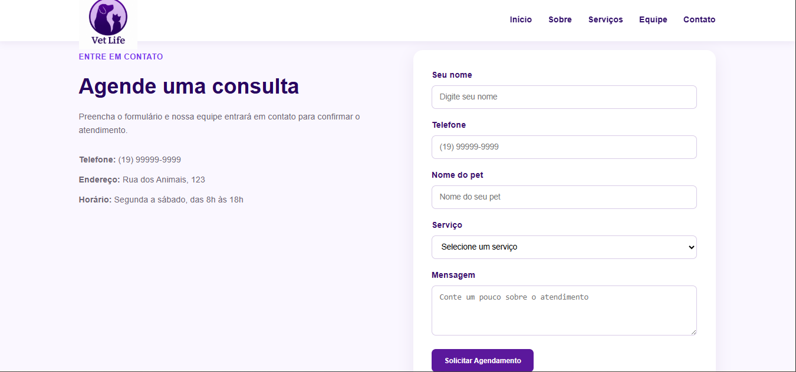

# Vet Life

Site responsivo desenvolvido para uma clínica veterinária fictícia, com foco em apresentação profissional, navegação simples e adaptação para diferentes tamanhos de tela.

O **Vet Life** foi criado com HTML, CSS e JavaScript para apresentar os principais serviços da clínica, sua equipe, diferenciais e uma área de contato com formulário de agendamento.

## Funcionalidades

- Página inicial com destaque para a clínica
- Seção institucional "Sobre"
- Apresentação dos principais serviços veterinários
- Área com equipe de profissionais
- Seção de diferenciais
- Formulário de contato e solicitação de agendamento
- Menu de navegação responsivo
- Layout adaptado para computadores, tablets e smartphones
- Validação simples do formulário com JavaScript
- Identidade visual própria em tons de roxo e lilás

## Tecnologias utilizadas

- HTML5
- CSS3
- JavaScript
- Design Responsivo

## Estrutura do projeto

```text
VetLife/
├── index.html
├── css/
│   └── styles.css
├── js/
│   └── script.js
└── img/
    └── logo-vet-life.png
```

## Responsividade

O site foi desenvolvido com layout responsivo e utiliza media queries para adaptar a interface a diferentes tamanhos de tela.

Em telas menores:

- o menu tradicional é substituído por um menu mobile;
- os cards passam de várias colunas para uma coluna;
- os botões e formulários se ajustam à largura disponível;
- textos, imagens e espaçamentos são reorganizados para facilitar a navegação.

Dessa forma, o Vet Life pode ser utilizado tanto em computadores quanto em smartphones e tablets.

# Screenshots

## Início

Página inicial com a apresentação principal da Vet Life e acesso rápido ao agendamento e aos serviços.



## Sobre

Seção que apresenta a proposta da clínica e seus principais diferenciais.



## Serviços

Área com os serviços oferecidos pela clínica, incluindo consultas, vacinação, exames, cirurgias, emergência e prevenção.



## Equipe

Apresentação dos profissionais da clínica e suas áreas de atuação.



## Contato e Agendamento

Formulário para solicitação de atendimento, com dados de contato, serviço desejado e informações do pet.



## Objetivo do projeto

O Vet Life foi desenvolvido como projeto de portfólio com o objetivo de aplicar conhecimentos de:

- desenvolvimento front-end;
- criação de páginas responsivas;
- organização de layouts com CSS;
- navegação por seções;
- formulários em HTML;
- manipulação de elementos com JavaScript;
- experiência de uso em dispositivos móveis.

## Possíveis melhorias futuras

- Integração do formulário com WhatsApp ou e-mail
- Envio real das solicitações de agendamento
- Integração com banco de dados
- Área administrativa
- Cadastro de pacientes e tutores
- Agendamento online com escolha de data e horário
- Integração com mapa e localização da clínica

## Site online

Acesse a versão publicada do projeto:

https://vetlife-one.vercel.app

## Autor

Desenvolvido por **Martchellinho**.

GitHub: https://github.com/Martchellinho
